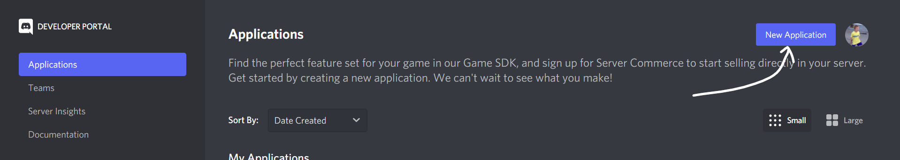
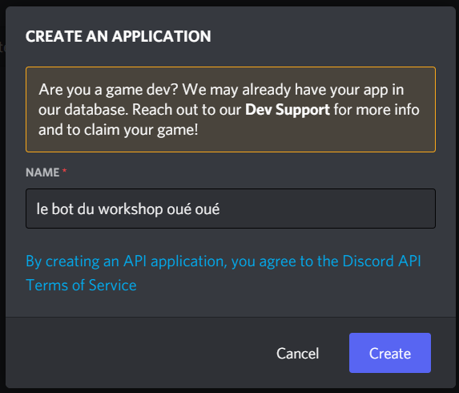
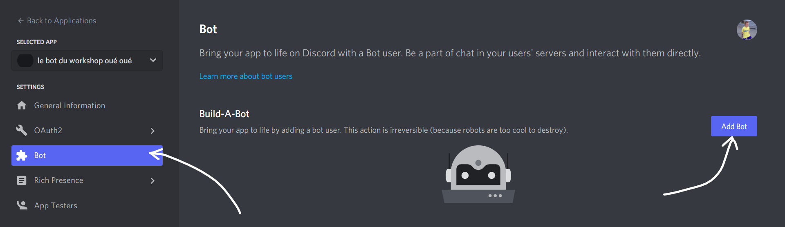
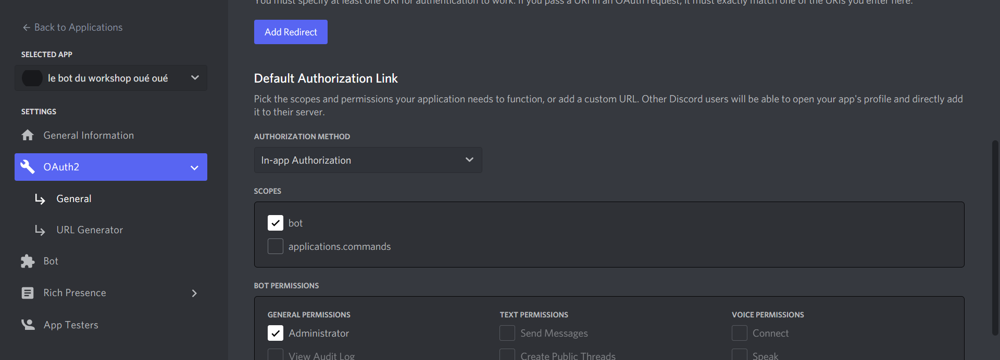
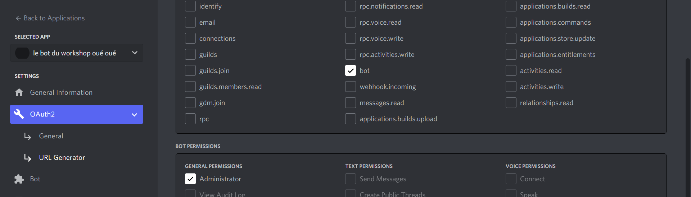
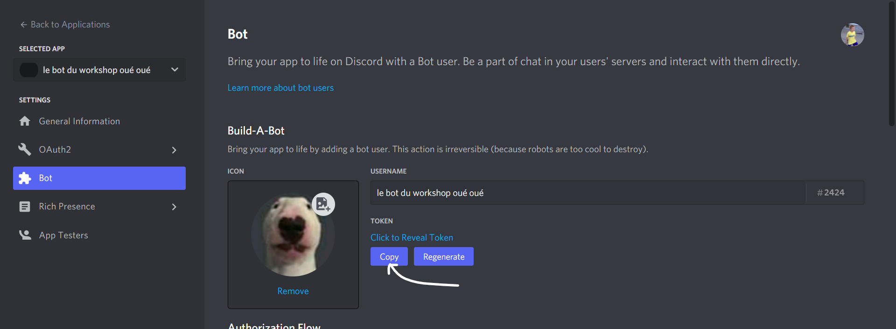
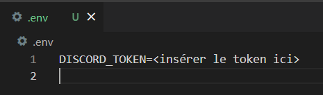
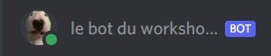
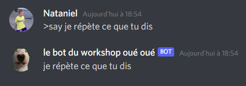

# Workshop - Bot discord python

[](https://choosealicense.com/licenses/gpl-3.0/)

Un petit workshop Epitech pour faire un bot discord en python !

#

## Introduction

On va utiliser le wrapper python de l'API de Discord afin de coder un début de bot et de se familiariser avec l'API
La version "rewrite" du wrapper python sera utilisée afin de supporter les dernières fonctionnalités de Discord.

Différents wrappers existent pour l'API de Discord. Il n'y a pas de différence de perf majeure entre les wrappers Python, JS, C#, etc...

Le but de ce workshop n'est pas de vous faire recoder MEE6 mais bien de vous montrer la puissance et le côté très accessible de l'outil.

#
## Outils
> Python

Afin de pouvoir réaliser ce workshop, il vous faudra une installation à jour de python (version 3.5.3 minimum). Afin de vérifier votre installation :

`$ python3 --version`

Nous allons ensuite avoir besoin de pip pour installer les modules nécéssaires :

Ubuntu - Debian : `$ apt install python3-pip`

Fedora - RHEL : `$ dnf install python3-pip`

Arch - Manjaro : `$ pacman -S python3-pip`

Une fois votre version de python et de pip à jour, nous pouvons procéder à l'installation des modules nécéssaires.

> Lib Discord

`$ python3 -m pip install -U discord.py`

Je vais donc vous laisser ouvrir votre éditeur de texte préféré, éventuellement équipé de diverses extensions pour coder en python.

---

# Le commencement

## Création de l'application

Pour pouvoir créer votre premier bot, il faut se connecter à son compte Discord sur la page [Discord Developers](https://discord.com/login?redirect_to=%2Fdevelopers%2Fapplications).

Une fois sur le portail développeur, il vous faudra créer une nouvelle application.



Quelques infos vous seront demandées pour finir la création de l'application. (mettez un nom un peu marrant, histoire que vous reconnaissiez votre bot ensuite)



Félicitations, votre application est vivante !


## Création d'un utilisateur "bot"

Naviguez dans le menu "Bot" dans la barre de gauche



Puis cliquez sur le bouton "Add bot". Et voilà, le bot est né !


## Gestion des permissions

Pour l'instant, je vous recommande d'activer toutes les options des "Priviledged Gateway Intents", ça nous permettra de tester plein de choses sans être bloqués par un manque de perms. Pour un vrai bot censé partir en production c'est toujours mieux de limiter la portée des permissions au strict nécessaire

Même chose pour les "Bot Permissions" juste en dessous, des permissions administrateur permettent de ne pas être limités pendant la phase de test et de découverte.

Pensez à sauvegarder les changements, ne fermez pas la page ! (on en aura besoin plus tard)

---

# Inviter le bot sur le serveur

Maintenant que le bot est crée et mis en place correctement, nous allons pouvoir l'inviter sur notre serveur de test, que vous pouvez rejoindre [ici](https://discord.gg/kSrQajP94r).

Afin de pouvoir inviter le bot, il nous faudra creer le lien d'invitation de celui-ci. Pour cela, il faut retourner sur la page Discord Developer de notre bot, puis naviguer dans l'onglet OAuth2 sur la gauche.



Ensuite, remplissez les champs comme ci-dessus (In-App authorization, scope bot, permissions Administrator)

Encore dans le panneau de gauche, nous allons nous rendre dans "URL Generator", puis cocher quelques cases supplémentaires (promis, c'est bientôt fini)



Nous allons encore séléctionner le scope "bot", puis les permissions administrateur, pour enfin trouver notre lien tout neuf en bas de la page !

En cliquant sur celui-ci vous allez pouvoir inviter le bot sur le serveur rejoint précédemment, normalement vous avez les perms pour ça.

Si vous comptez mettre le bot sur d'autres serveurs, gardez le lien bien au chaud, ça vous évitera de devoir refaire cette étape.

## Le bot est sur le serveur, let's goooooo !

---

# Hello world

###### fichier : helloworld.py

Enfin, on va coder !

Le wrapper discord.py fonctionne sur une base de fonctions asynchrones et d'events. Pour plus d'infos, je vous invite à lire [la documentation](https://discordpy.readthedocs.io/en/stable/) et l'[API Reference](https://discordpy.readthedocs.io/en/stable/api.html).

La base de notre bot va tourner autour du "client", qui représente dans le code l'utilisateur que nous avons crée précédemment.

La déclaration du client est réalisée comme suit :

```
#coding=utf8

import discord

client = discord.Client()
```

Sauf que là, si on lance le programme, eh bah il se passe pas grand chose :/

# Récupération du token de connexion

Pour qu'il se passe quelque chose, on va devoir aller chercher le token de notre bot sur le portail développeur



**ATTENTION !** : si quelqu'un trouve le moyen de récupérer ce token, cette personne aura le contrôle total de votre bot (et accessoirement des serveurs sur lesquels il se trouve) (mauvaise idée, vu qu'on l'a mis admin)

Ce token permet de prendre contrôle du bot, et de recevoir les divers events depuis l'API Discord. Cela est bien evidemment nécessaire pour pouvoir développer plein de fonctionnalités rigolotes.

Comme évoqué précedemment, il est important de garder notre token le plus caché possible. Nous allons donc utiliser le module dotenv pour nous permettre de stocker le token dans un fichier caché, séparé de notre code.

Ce fichier caché (appellé *.env*) permet d'ajouter une variable d'environnement présente uniquement dans le dossier d'exécution du bot. La syntaxe est la suivante :



Installation du module python-dotenv :

`$ pip install python-dotenv`

Une fois le module installé, nous allons pouvoir ajouter les lignes suivantes dans notre programme :

```
from dotenv import load_dotenv
from os import getenv

load_dotenv()
TOKEN = getenv('DISCORD_TOKEN')
```

Nous avons donc récupéré le token dans la variable globale *TOKEN*. Le fonctionnement peut être vérifié avec un simple `print(TOKEN)`.

Notre bot peut désormais communiquer avec l'API de Discord, il ne nous manque plus qu'à lui dire de se connecter.

Cela est effectué en ajoutant cette ligne à la toute fin du fichier (elle devra rester à la fin, car elle joue le rôle d'un "main"):

`client.run(TOKEN)`

Désormais, à l'exécution du programme, le bot apparaît avec un statut "connecté" sur le serveur !



# Mise en place du "on_ready"

Au tout début du workshop, j'ai évoqué le fonctionnement du wrapper python par évenements asynchrones. Nous allons ici coder notre premier gestionnaire d'events, le "on_ready". Cet event sera déclenché à chaque connexion du bot au service, une fois que celle-ci est effectuée et que tout est en ordre.

```
@client.event
async def on_ready() -> None :
    print(f"Je suis connecté à discord avec le compte '{client.user}' !")
    serveur = client.guilds[0]
    channel = serveur.get_channel(948344509006229504)
    if channel is not None :
        await channel.send("Bonjour discord !")
    else :
        print("Oups, je n'ai pas pu récupérer le channel")
```

On peut voir ici la syntaxe pour déclarer un gestionnaire d'évènements, ainsi que les fonctions asynchrones. Encore une fois, je vous invite à lire l'[API Reference](https://discordpy.readthedocs.io/en/stable/api.html) pour plus d'infos, et aussi pour découvrir tous les évènements disponibles pour un bot.

---

# Lecture et réaction aux messages

###### fichier : message_reader.py

Avoir un bot qui parle c'est bien, mais un bot qui répond quand on parle de lui, c'est mieux !

Pour la suite, on va garder la même base que ce qui a été réalisé jusqu'à présent, en ajoutant des blocs pour faire ce qui nous plaît.

# Event "on_message"

Comme son nom l'indique, il sera appellé dès qu'un nouveau message est envoyé dans un salon visible par le bot. C'est l'event qui sera appellé le plus souvent, donc il est important de minimiser l'utilisation des ressources dans la fonction de base.

Ici, nous allons juste coder un petit gestionnaire d'event qui répondra au message quand quelqu'un dira le nom du bot.

```
@client.event
async def on_message(message) :
    if client.user.name in message.content :
        await message.reply("coucou c'est moi")
```

Les objets [*client*](https://discordpy.readthedocs.io/en/stable/api.html#clientuser), [*message*](https://discordpy.readthedocs.io/en/stable/api.html#message), [*user*](https://discordpy.readthedocs.io/en/stable/api.html#user), etc... sont des classes déclarées dans la librairie discord.py, et elles sont composées de (beaucoup) de champs et de méthodes. Encore une fois, tout est très bien expliqué dans la doc, et vous trouverez toutes les infos techniques là bas !

# Ajout de réactions

En plus de pouvoir nous répondre, le bot a accès à toutes les fonctionnalités qu'un utilisateur normal pourrait utiliser, on peut donc ajouter des réactions !

`await message.add_reaction("💯")`

La fonction "add_reaction" prend en charge tous les emojis de base, ainsi que l'identifiant des emojis customisés. Ceux-ci sont utilisables dans tous les serveurs où le bot est présent. C'est une sorte d'abonnement nitro gratuit, donc plutôt cool ! (j'ai déjà essayé d'utiliser un compte de bot comme compte personnel, ça ne marche pas) (c'est aussi interdit par les conditions d'utilisation...)

---

# Utilisation de commandes

###### fichiers : command_bot.py, commands.py

Les commandes sont un élément nécessaire pour tout bot qui se respecte ! La librairie nous procure un utilisateur "bot" en plus du client que nous utilisons déjà, le bot permettant de déclarer des commandes très facilement. Seul point négatif, le "bot" nous restreint au niveau des fonctionnalités disponibles sur les commandes, et est globalement moins pratique à utiliser.

Nous allons donc recoder notre propre gestionnaire de commandes !

```
if message.content and message.content[0] == '>' :
        cmd = str(message.content.split()[0])
        cmd = cmd[1:]
        try :
            fonction = getattr(commands, cmd)
            await fonction(message,client)
        except (AttributeError) :
            await message.add_reaction("⁉️")
```

Ce bout de code va venir dans notre gestionnaire "on_message" pour détecter le préfixe de la commande, ce qui va déclencher le parsing du message.

Nous allons ensuite essayer de récupérer la fonction correspondante dans le fichier *commands.py* (que nous importons en tant que module au début du fichier)

Les arguments de toutes les commandes dans ce fichier doivent être les mêmes pour ne pas causer de problèmes avec *getattr()*.

Si la commande demandée n'existe pas, *getattr()* envoie un *AttributeError*, dont nous nous servons pour signifier à l'utilisateur que la commande n'est pas disponible.

Ce système nous permet de remplacer un "if elif else" énorme, mais aussi d'implémenter une nouvelle commande avec un simple redémarrage du bot, sans besoin de modifier le gestionnaire d'évènements.

Comme commande témoin, nous pouvons implémenter un "say", qui se contentera de répéter le message de l'utilisateur.

```
#coding=utf8

import discord

async def say(message, client) :
    text = str(message.content.split(' ', 1)[1])
    await message.channel.send(text)
```



J'espère que ce workshop vous a plu, je vous laisse utiliser votre imagination pour proposer des commandes rigolotes !

N'hésitez surtout pas en cas de questions !